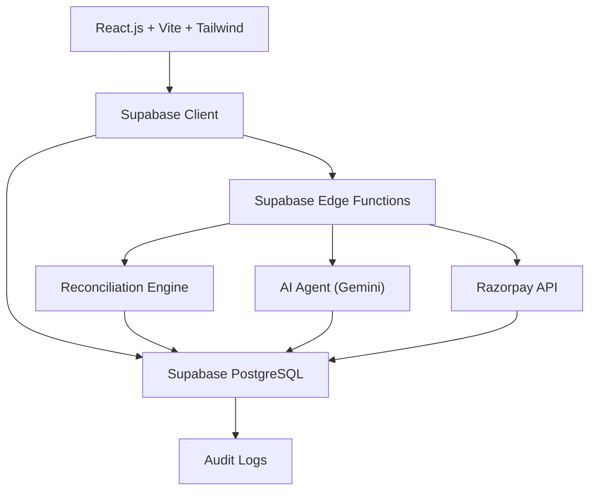

# IniRazorAI — AI Finance Controller

> **Razorpay AI Buildathon — Track 04: AI Finance Controller**

**IniRazorAI** is an AI-powered payment and settlement reconciliation controller that automatically matches financial records, investigates ambiguous discrepancies, resolves safe cases, escalates uncertain cases, and maintains a complete audit trail.

## 🎯 Problem

Merchants receive customer payments through payment gateways and later receive settlements. Finance teams need to verify that:

- Payments were correctly settled
- Fees were correctly deducted
- Taxes (GST) were correctly accounted for
- Refunds were reflected
- Adjustments were valid
- No settlements are missing
- No duplicate records exist

**IniRazorAI answers:** *"Does this payment correctly reconcile with its settlement, and if not, can we explain the discrepancy?"*

## 🏗️ Architecture



### Core Principle

> **Code calculates. AI reasons. Humans approve uncertainty.**

| Layer | What It Does |
|-------|-------------|
| **Deterministic Engine** | ID matching, arithmetic, fee/tax calculations, duplicate detection |
| **AI Agent (Gemini)** | Investigates ambiguous discrepancies, explains likely causes |
| **Human Review** | Approves/rejects AI recommendations when confidence < 90% |
| **Audit Trail** | Logs every action with timestamps, actors, and reasoning |

## 🤖 Why AI?

AI is used **only** for ambiguous cases that deterministic code cannot resolve:

- ✅ **Deterministic:** Exact matching, fee calculations, missing settlement detection
- ✅ **Deterministic:** Tax calculations, duplicate detection, status validation
- 🧠 **AI:** Unexplained differences, interpreting adjustment patterns
- 🧠 **AI:** Recommending whether a case can safely be resolved
- 👤 **Human:** Final approval when AI confidence is below threshold

The AI **never** modifies financial data, creates records, or initiates transactions.

## 📊 Dataset

- **500 synthetic records** with realistic Indian payment data
- Ground truth stored for evaluation (never sent to AI)

| Category | % | Count |
|----------|---|-------|
| Normal matches | 70% | 350 |
| Fee/Tax differences | 10% | 50 |
| Refund differences | 5% | 25 |
| Adjustment differences | 5% | 25 |
| Missing settlements | 4% | 20 |
| Duplicates | 3% | 15 |
| Unexplained mismatches | 2% | 10 |
| Invalid data | 1% | 5 |

## 📈 Metrics

All metrics are calculated dynamically from real reconciliation results:

- **Match Rate** — Percentage of records correctly matched
- **Accuracy** — System predictions vs ground truth
- **Precision** — True positives / (True positives + False positives)
- **Recall** — True positives / (True positives + False negatives)
- **F1 Score** — Harmonic mean of precision and recall
- **Exception List** — Honest list of unresolvable cases

## 🛡️ Failure Handling

- **AI timeout/error:** Transaction escalated to `NEEDS_REVIEW` with audit log
- **Low confidence:** Never auto-resolves below 90% threshold
- **Deliberate failure:** Includes an intentionally unresolvable transaction to demonstrate honest failure
- **Invalid AI response:** Validated and rejected with safe fallback

## 💳 Razorpay Integration

| Mode | Status |
|------|--------|
| **Demo Mode** | Full 500-record dataset, no credentials needed |
| **Razorpay Test Mode** | Fetches test payments via Razorpay API |

The app is fully functional in Demo Mode without any external credentials.

## 🚀 Setup

### Prerequisites

- Node.js 18+
- npm or yarn

### Installation

```bash
# Clone the repository
git clone https://github.com/yourusername/InirazorAI.git
cd InirazorAI

# Install dependencies
npm install

# Start development server
npm run dev
```

### Demo Mode (No Setup Required)

Just run `npm run dev` — the app works immediately with synthetic data.

**Demo credentials:**
- Email: `admin@inirazor.ai`
- Password: `admin123`

### Supabase Setup (Optional)

1. Create a project at [supabase.com](https://supabase.com)
2. Run the migration: `supabase/migrations/001_create_tables.sql`
3. Copy `.env.example` to `.env` and fill in:

```env
VITE_SUPABASE_URL=your-project-url
VITE_SUPABASE_ANON_KEY=your-anon-key
```

4. Set Edge Function secrets:

```bash
supabase secrets set AI_API_KEY=your-gemini-key
supabase secrets set AI_MODEL=gemini-2.0-flash
supabase secrets set RAZORPAY_KEY_ID=your-key
supabase secrets set RAZORPAY_KEY_SECRET=your-secret
```

5. Deploy Edge Functions:

```bash
supabase functions deploy razorpay-sync
supabase functions deploy fetch-payments
supabase functions deploy investigate-exception
supabase functions deploy persist-reconciliations
supabase functions deploy persist-audit-logs
supabase functions deploy fetch-reconciled-data
```

## 🧪 Testing

The reconciliation engine includes tests for all 12 scenarios:

1. Exact match
2. Fee difference
3. Tax difference
4. Refund discrepancy
5. Adjustment discrepancy
6. Missing settlement
7. Duplicate settlement
8. Amount mismatch
9. Unknown discrepancy
10. AI failure handling
11. Human approval workflow
12. Audit log creation


## 🔒 Security

- Razorpay secret key: server-side only (Edge Functions)
- AI API key: server-side only (Edge Functions)
- Supabase service-role key: never in frontend
- Row Level Security enabled on all tables
- AI responses validated before acceptance
- No secrets committed to repository

## 📁 Project Structure

```
├── src/
│   ├── components/     # Reusable UI (KPICard, StatusBadge, DataTable, etc.)
│   ├── pages/          # Route-level pages
│   ├── layouts/        # MainLayout with sidebar + header
│   ├── services/       # Data service, AI service, reconciliation engine
│   ├── hooks/          # useAuth
│   ├── utils/          # Constants, formatters, synthetic data generator
│   ├── charts/         # Recharts components
│   └── features/       # Feature-specific modules
├── supabase/
│   ├── functions/      # Edge Functions (5 functions)
│   ├── migrations/     # SQL schema
│   └── config.toml
├── .env.example
└── README.md
```

## 🏆 Built For

**Razorpay AI Buildathon — Track 04: AI Finance Controller**

Built by **Iniyan** — IniRazorAI: Intelligent Innovation
